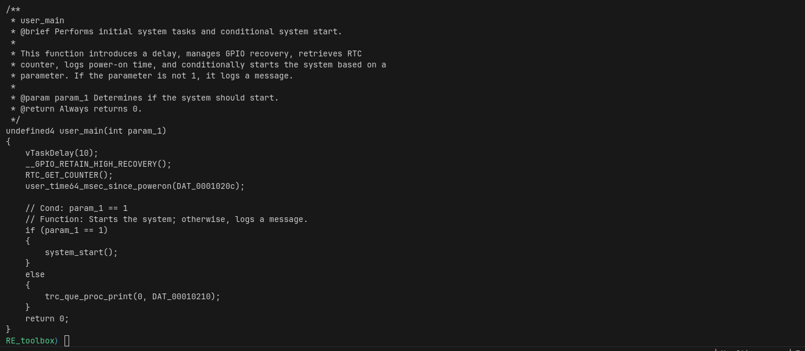

## Reverse-Engineering Toolbox (RE Toolbox)

The Reverse-Engineering Toolbox is a command-line REPL that facilitates reverse engineering and automated program repair efforts.
The REPL is designed to provide a simplified interface to common RE functions.
A plugin system is available for adding new tools to the toolbox.

### Setup

#### Build Docker Image
To build the docker image, run `./build_docker.sh.` from the root directory.
It builds a specific version of python, so it may take some time on first build

In order to use the ChatGPT-based plugins, you will have to add your OpenAI API key to the relevant location in the docker file

#### Run Docker Image
To run the docker image, run `./run_docker.sh`.
This will create a docker container and drop you into the REPL.
Note that the `exit` command is not currently working properly and you will need to
use `CTRL+D` to quit the REPL.
There are two folders that are created `graph` and `struct` that map to volumes within the container.
These are used as auxilliary storage for the AccessPatternGraph output.

### Plugins / Other tools
Plugins are added via a YAML file in the `plugins` directory.
There are currently six plugins and one not-quite plugin.
The `clang_format` and `demangle` plugins can be used as examples of a basic plugin.

To view the available plugins, run `tool list`:

#### ComCat
This plugin uses ChatGPT and requires a valid API key to be present when building the Docker image.
Comcat uses ChatGPT to add comments to source code.
An example run of ComCat is the following:

- `load examples/user_main.c source`
- `print`
- `tool run ComCat`
- `print`

#### DeGPT
This plugin uses ChatGPT and requires a valid API key to be present when building the Docker image
Note: this plugin can take minutes to run, and there is no output until it is completed, so be patient.

While DeGPT can be run on original source code, it makes more sense to run in on source code decompiled from a binary.
An example run of DeGPT is the following:

- `load examples/user_main.c source`
- `print`
- `tool run DeGPT`
- `print`

OR

- `load examples/user_main.o bytecode`
- `decompiler decompile`
- `print`
- `tool run DeGPT`
- `print`

#### KLEE
This plugin must be run on LLVM bytecode.

- `load examples/wifi_new.bc bytecode`
- `tool run klee`

While the output suggests running `tool run klee /examples...`, that is not currently a valid command.

### Examples

#### Basic usage

Decompiling a single function:

- `load examples/user_main.o bytecode`
- `decompiler list-functions`
- `decompiler decompile user_main`
- `print`
- `save source.c`

#### Basic Plugin usage

Running a plugin and saving the resulting file:

- `load examples/user_main.c source`
- `print`
- `info`
- `tool list`
- `tool run clang_format`
- `save formatted.c`
- `info`

#### Comprehensive Example
The tools and transformations can be chained together to incrementally change a file. 
Suppose we want to decompile a binary, clean it up through DeGPT, add some comments to make it easier to understand, and lastly run it format it so that it is easier to read.
That can be done with the following sequence. 
After each operation, the current state of the file can be printed or the file can be saved for later review.

- `load examples/user_main.o bytecode`
- `decompiler decompile`
- `print`
- `tool run DeGPT`
- `print`
- `tool run ComCat`
- `print`
- `tool run clang_format`
- `print`

