## Reverse-Engineering Toolbox (RE Toolbox)

The Reverse-Engineering Toolbox is a command-line REPL that facilitates reverse engineering and automated program repair efforts.
The REPL is designed to provide a simplified interface to common RE functions.
A plugin system is available for adding new tools to the toolbox.

### Setup

#### Build Docker Image
To build the docker image, run `./build_docker.sh.` from the root directory.
It builds a specific version of python, so it may take some time on first build

In order to use the ChatGPT-based plugins, you will have to add your OpenAI API key to the relevant location in the docker file
In order to use the LLM-based decompiler, you will have to add your DeepSeek API key to the relevant location in the docker file

#### Run Docker Image
To run the docker image, run `./run_docker.sh`.
This will create a docker container and drop you into the REPL.
Note that the `exit` command is not currently working properly and you will need to
use `CTRL+D` to quit the REPL.

### Decompilers
There are currently two decompilers that are available for use, as seen by running `decompiler list`.
Note: there are four decompilers listed, but 'LLM', 'RAG_mbpp', and 'RAG_exe_bench' are all the same
LLM-based decompiler but with different configurations.

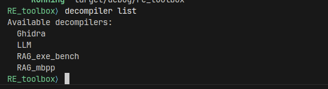

By default, 'ghidra' is used as the decompiler. To change to a different decompiler, use `decompiler set <decompiler>`
Be patient when running `decompiler decompile`, as the various decompilers can take upwards of a few minutes.

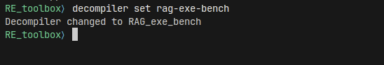

### Plugins / Other tools
Plugins are added via a YAML file in the `plugins` directory.
There are currently six plugins available to be run on either source code or bytecode depending on the plugin.
The `clang_format` and `demangle` plugins can be used as examples of a basic plugin.

To view the available plugins, run `tool list`:

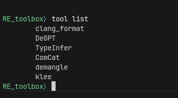

#### ComCat
This plugin uses ChatGPT and requires a valid API key to be present when building the Docker image.
Comcat uses ChatGPT to add comments to source code.
An example run of ComCat is the following:

- `load examples/user_main.c source`
- `print`
- `tool run ComCat`
- `print`

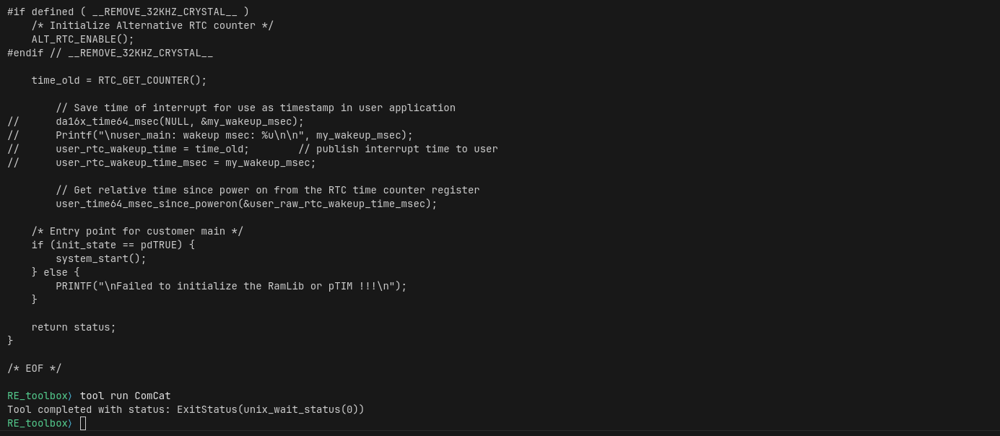
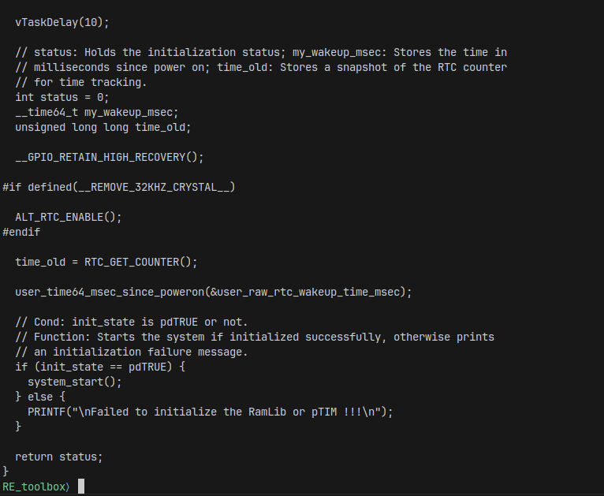

_New in this version:_ this plugin has been improved to provide better variable declaration commands, reduce overcommenting, and overall increase the quality of the comments.

#### DeGPT
This plugin uses ChatGPT and requires a valid API key to be present when building the Docker image
Note: this plugin can take minutes to run, and there is no output until it is completed, so be patient.

While DeGPT can be run on original source code, it makes more sense to run in on source code decompiled from a binary.
An example run of DeGPT is the following:

- `load examples/user_main.c source`
- `print`
- `tool run DeGPT`
- `print`

OR

- `load examples/user_main.o bytecode`
- `decompiler decompile`
- `print`
- `tool run DeGPT`
- `print`

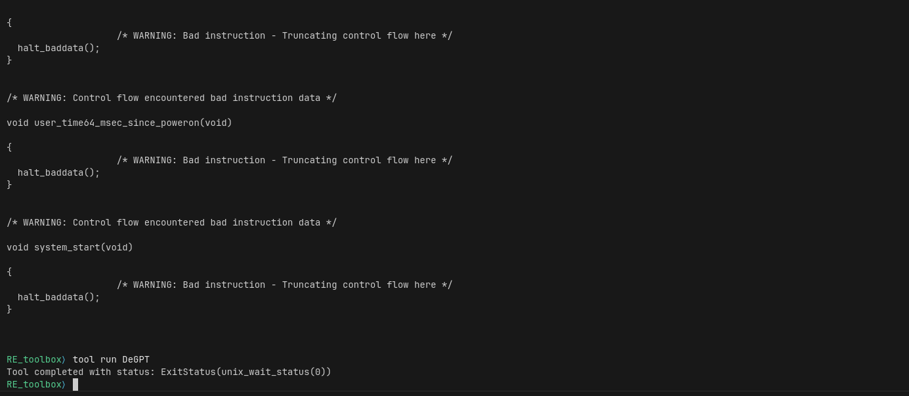
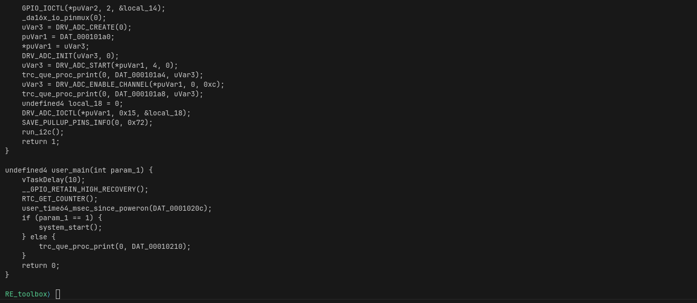

#### KLEE
This plugin must be run on LLVM bytecode.

- `load examples/wifi_new.bc bytecode`
- `tool run klee`

Example executions of the plugin can be found below:

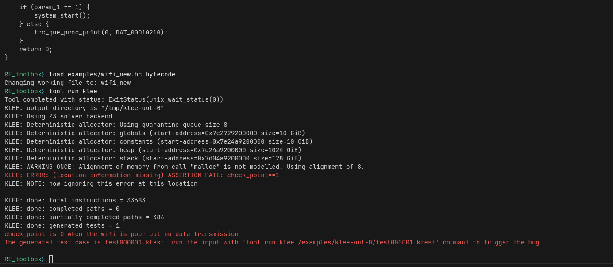
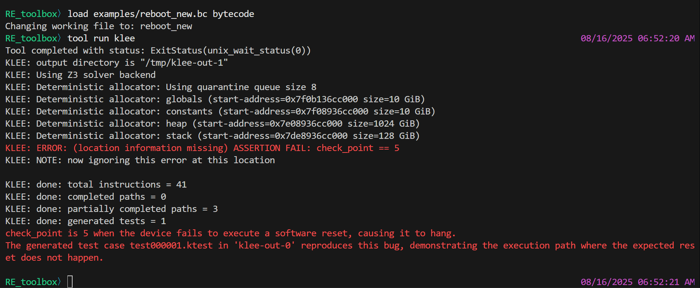
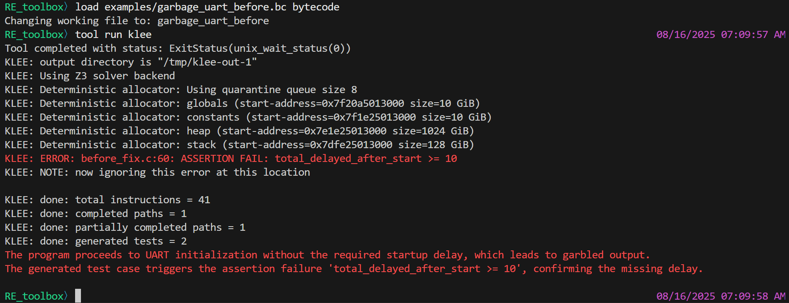

#### TypeInfer
This plugin uses a decompiled intermediate representation of a binary file to make inferences about structures that exist within the underlying code.
It can be used to regain information regarding how pieces of data relate to each other -- for example, does a chunk of memory represent a linked list.
Note: it cannot be run on every binary, as only a subset of the intermediate language is supported -- many of the example binaries will return an error mentioning INT_LESSEQUAL.

An example run of TypeInfer is the following:

- `load examples/linked-list-slo1.o bytecode`
- `tool run TypeInfer`

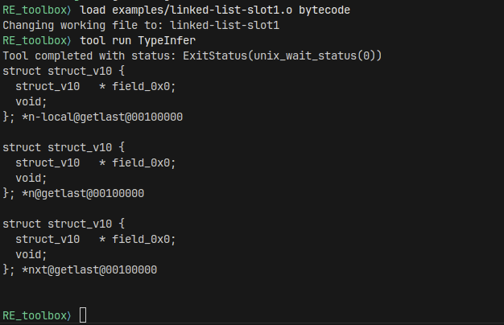

As seen in the screenshot, the plugin was able to recreate a struct in which the first field is a pointer to another instance of the struct.
This is the type of structure that would be expected for a linked list.
The output of the plugin still requires interpretation, but by rebuilding at least parts of stucts that are present, the user has more context as to what the code is doing

### Examples

#### Basic usage

Decompiling a single function:

- `load examples/user_main.o bytecode`
- `decompiler list-functions`
- `decompiler decompile user_main`
- `print`
- `save source.c`

Decompiling an entire function (with alternative decompiler):
- `decompiler set rag-exe-bench`
- `load examples/user_main.o bytecode`
- `print`

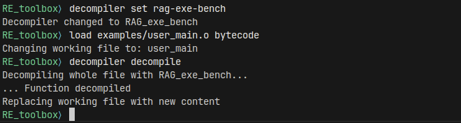

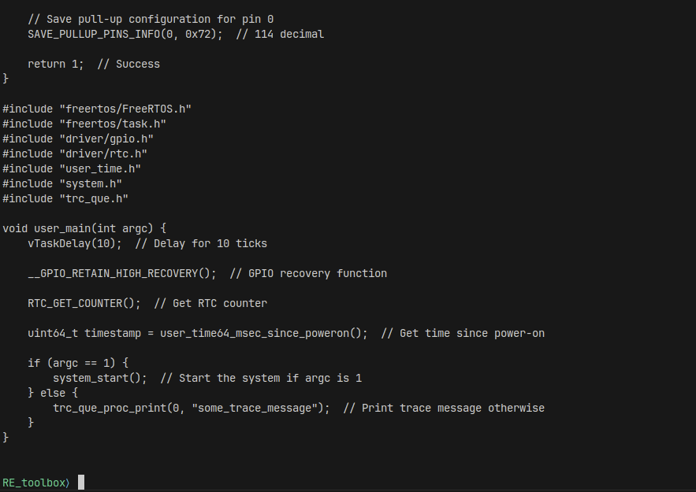

#### Basic Plugin usage

Running a plugin and saving the resulting file:

- `load examples/user_main.c source`
- `print`
- `info`
- `tool list`
- `tool run clang_format`
- `save formatted.c`
- `info`

#### Comprehensive Example
The tools and transformations can be chained together to incrementally change a file. 
Importantly, we can swap out the original use of the Ghidra decompiler with the new LLM-based decompiler
Suppose we want to decompile a binary, clean it up through DeGPT, add some comments to make it easier to understand, and lastly run it format it so that it is easier to read.
That can be done with the following sequence. 
After each operation, the current state of the file can be printed or the file can be saved for later review.
Note: the `TypeInfer` plugin is not used in this example as there are no structs present in the example binary and the tool does not currently support some of the instructions used.

- `load examples/user_main.o bytecode`
- `decompiler set rag-exe-bench`
- `decompiler decompile`

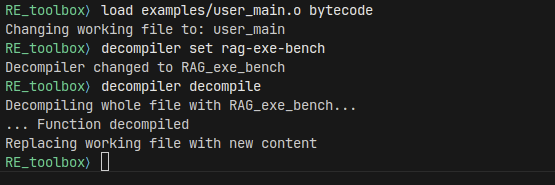

- `print`

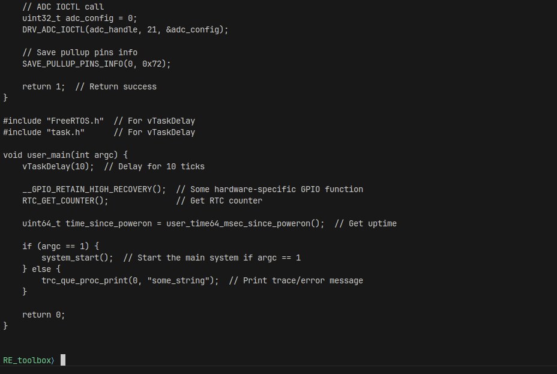

- `tool run DeGPT`
- `print`

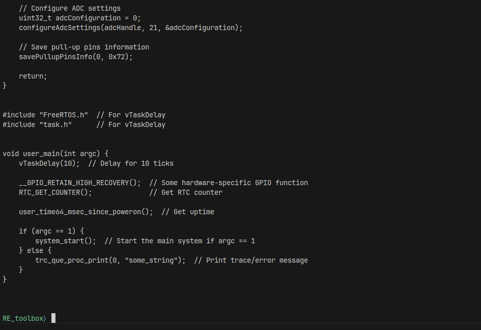

- `tool run ComCat`
- `print`

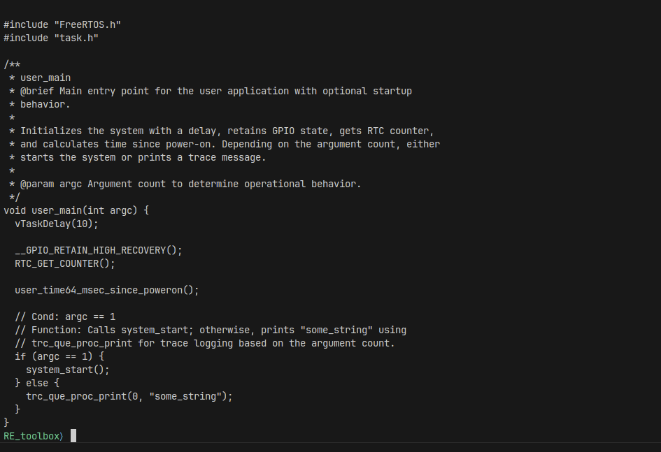

- `tool run clang_format`
- `print`

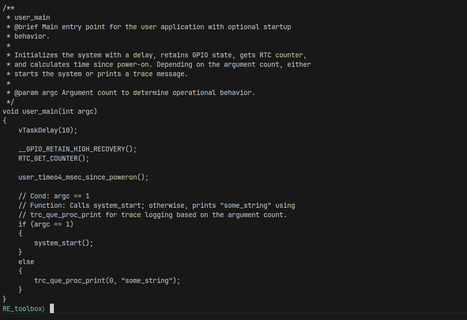
